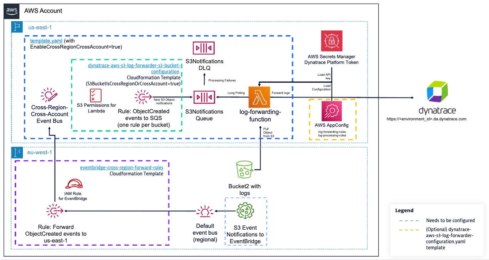
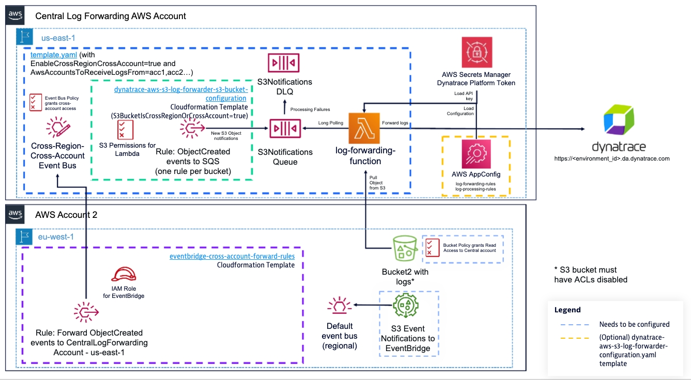

# Advanced Deployments

This page contains guidance and considerations for large deployments.

## Configuring S3 buckets with prefix filtering

The `S3BucketNames` parameter in `template.yaml` forwards logs from entire buckets. If you need to forward logs only from specific S3 key prefixes within a bucket, use the `dynatrace-aws-s3-log-forwarder-s3-bucket-configuration.yaml` template once per bucket instead.

Deploy the main stack without `S3BucketNames`:

```bash
aws cloudformation deploy \
    --stack-name ${STACK_NAME} \
    --template-file template.yaml \
    --capabilities CAPABILITY_IAM CAPABILITY_NAMED_IAM CAPABILITY_AUTO_EXPAND \
    --parameter-overrides \
        DynatraceEnvironmentURL="https://$DYNATRACE_TENANT_UUID.live.dynatrace.com" \
        DynatraceApiKey="<your_dynatrace-access-token-here>" \
        DynatraceS3LogForwarderLayerArn="$LAYER_ARN"
```

Then deploy the per-bucket stack for each bucket, specifying the prefixes to forward logs from:

```bash
export BUCKET_NAME=your-bucket-name

aws cloudformation deploy \
    --template-file dynatrace-aws-s3-log-forwarder-s3-bucket-configuration.yaml \
    --stack-name dynatrace-aws-s3-log-forwarder-s3-bucket-configuration-$BUCKET_NAME \
    --parameter-overrides \
        DynatraceAwsS3LogForwarderStackName=$STACK_NAME \
        LogsBucketName=$BUCKET_NAME \
        LogsBucketPrefix1=AWSLogs/123456789012/CloudTrail/ \
        LogsBucketPrefix2=AWSLogs/987654321098/CloudTrail/ \
    --capabilities CAPABILITY_IAM
```

You can specify up to 10 prefixes per bucket using `LogsBucketPrefix1` through `LogsBucketPrefix10`. Prefixes should end with `/` to match all objects under that path.

> [!WARNING]
>
> Do not add a bucket to both `S3BucketNames` in the main stack and a per-bucket configuration stack. The main stack's EventBridge rule matches all `Object Created` events from that bucket with no prefix filter, so objects in the prefix would be routed to SQS by both rules and ingested into Dynatrace twice.

<!-- -->

> [!NOTE]
>
> * If your S3 objects are encrypted with a customer-managed KMS key, add `KmsKeyArns="arn:aws:kms:region:account:key/uuid"` to the main stack deploy command so the Lambda function can decrypt them.
> * For cross-region or cross-account buckets, add the `S3BucketIsCrossRegionOrCrossAccount=true` parameter and deploy the `eventbridge-cross-region-or-account-forward-rules.yaml` template in the bucket's account/region. See [Cross-region](#forward-logs-from-s3-buckets-on-different-aws-regions) and [Cross-account](#forward-logs-from-s3-buckets-on-different-aws-accounts) sections below for details.
> * Each per-bucket stack adds an inline IAM policy statement to the Lambda execution role. See [IAM Role Policy size limit](#iam-role-policy-size-limit) below for scaling considerations.

## Custom log forwarding and processing rules via AppConfig

By default the forwarder uses built-in rules bundled in the Lambda package. For runtime customisation — changing which logs are forwarded and how they are parsed — without redeploying Lambda, deploy the optional AppConfig stack.

### Step 1. Deploy the AppConfig stack

```bash
aws cloudformation deploy \
    --template-file dynatrace-aws-s3-log-forwarder-appconfig.yaml \
    --stack-name ${STACK_NAME}-appconfig \
    --parameter-overrides DynatraceAwsS3LogForwarderStackName=${STACK_NAME} \
    --capabilities CAPABILITY_IAM
```

This creates an AppConfig application named `${STACK_NAME}-app-config` with two configuration profiles pre-populated with defaults:

* `log-forwarding-rules` — controls which S3 buckets and key prefixes are forwarded and with which source
* `log-processing-rules` — optional custom parsing rules that override or supplement built-ins

The AppConfig application ID is exported to SSM at `/dynatrace/s3-log-forwarder/${STACK_NAME}/appconfig-application-id`.

### Step 2. Switch the forwarder to AppConfig

Update the main stack to pull rules from AppConfig instead of the bundled local defaults:

```bash
aws cloudformation deploy \
    --stack-name ${STACK_NAME} \
    --template-file template.yaml \
    --capabilities CAPABILITY_IAM CAPABILITY_NAMED_IAM CAPABILITY_AUTO_EXPAND \
    --parameter-overrides LogForwarderConfigurationLocation=aws-appconfig
```

### Step 3. Customise the rules

Edit the configuration profiles in the [AWS AppConfig console](https://console.aws.amazon.com/appconfig/) under the `${STACK_NAME}-app-config` application and deploy a new version. The Lambda picks up changes within ~1 minute without requiring a redeployment.

For rule syntax and examples see [log_forwarding.md](log_forwarding.md) and [log_processing.md](log_processing.md).

## IAM Role path

Some organizations enforce IAM governance policies that require roles to be created under a specific path (e.g. `/engineering/` or `/service-roles/`). Without the correct path, CloudFormation stack deployment will fail with an access denied error.

Use the `IamRolePath` parameter to set the path for the Lambda execution role:

```bash
aws cloudformation deploy \
    --stack-name ${STACK_NAME} \
    --template-file template.yaml \
    --capabilities CAPABILITY_IAM CAPABILITY_NAMED_IAM CAPABILITY_AUTO_EXPAND \
    --parameter-overrides \
        DynatraceEnvironmentURL="https://$DYNATRACE_TENANT_UUID.live.dynatrace.com" \
        DynatraceApiKey="<your_dynatrace-access-token-here>" \
        DynatraceS3LogForwarderLayerArn="$LAYER_ARN" \
        IamRolePath="/engineering/platform/"
```

The path must start and end with `/`. If not specified, the role is created at the root path `/`.

## Forward logs from S3 buckets on different AWS regions

It's possible to centralize log forwarding from S3 buckets on different AWS regions on a single `dynatrace-aws-s3-log-forwarder` deployment on a specific AWS region to avoid the overhead of deploying and managing multiple S3 log forwarders.

In this case, you will need to configure Amazon EventBridge rules on the AWS region where your S3 bucket is to forward S3 Object Created notifications to a dedicated event bus on the AWS region where you have deployed the `dynatrace-aws-s3-log-forwarder`. Before proceeding, make sure you have deployed the `dynatrace-aws-s3-log-forwarder` setting the `EnableCrossRegionCrossAccountForwarding` parameter to "true", so a dedicated Event Bus is created to receive cross-region notifications. If you didn't set this parameter when you deployed the forwarder, you can simply update the log forwarder CloudFormation stack to enable it.

```bash
aws cloudformation deploy --stack-name $STACK_NAME --parameter-overrides \
    EnableCrossRegionCrossAccountForwarding=true \
    --template-file template.yaml --capabilities CAPABILITY_IAM CAPABILITY_NAMED_IAM CAPABILITY_AUTO_EXPAND
```

The diagram below showcases what needs to be deployed to enable cross-region log forwarding:



For each S3 bucket located in a different AWS region than where the log forwarder is, that you want to forward logs from to Dynatrace, follow the below steps:

1. Deploy the `eventbridge-cross-region-or-account-forward-rules.yaml` CloudFormation template on the region where your S3 bucket is. This template will deploy an Amazon EventBridge rule to forward S3 Object Created notifications for the bucket and optional prefixes defined, as well as a required IAM role for EventBridge to forward the notifications to the destination region.

    To deploy the template replace the placeholder values:

    ```bash
    export STACK_NAME=your_log_forwarder_stack_name
    export BUCKET_NAME=your_bucket_name_here
    export REGION=region_of_your_bucket
    ```

    Then, execute the following commands:

    ```bash
    export EVENT_BUS_ARN=$(aws cloudformation describe-stacks \
                                --stack-name $STACK_NAME \
                                --query 'Stacks[].Outputs[?OutputKey==`CrossRegionCrossAccountEventBus`].OutputValue' \
                                --output text)
    if [ ! -z $EVENT_BUS_ARN ]
    then
      aws cloudformation deploy \
        --template-file eventbridge-cross-region-or-account-forward-rules.yaml \
        --stack-name dynatrace-aws-s3-log-forwarder-cross-region-notifications-$BUCKET_NAME \
        --parameter-overrides CrossRegionCrossAccountEventBusArn=$EVENT_BUS_ARN \
            LogsBucketName=$BUCKET_NAME \
        --capabilities CAPABILITY_IAM \
        --region $REGION
    else
      echo "ERROR, Event bus ARN not found in CloudFormation stack: $STACK_NAME. Confirm parameter EnableCrossRegionCrossAccountForwarding is set to true"
    fi
    ```

    **NOTE:** You can limit log forwarding for specific S3 bucket prefixes (e.g. dev/) adding up to 10 LogBucketPrefix# optional parameters to the above command.

1. Once the above stack is deployed, go to your S3 bucket(s) and enable notifications via EventBridge following instructions [here](https://docs.aws.amazon.com/AmazonS3/latest/userguide/enable-event-notifications-eventbridge.html).

1. Last, deploy the `dynatrace-aws-s3-log-forwarder-s3-bucket-configuration.yaml` CloudFormation template on the AWS region where the `dynatrace-aws-s3-log-forwarder` is deployed. This template will deploy the required regional Amazon EventBridge rules to send the cross-region forwarded notifications to the S3 forwarder Amazon SQS queue, as well as grant IAM permissions to the AWS Lambda function to access your S3 bucket. Make sure the `S3BucketIsCrossRegionOrCrossAccount` parameter is set to "true".

    ```bash
    aws cloudformation deploy \
      --template-file dynatrace-aws-s3-log-forwarder-s3-bucket-configuration.yaml \
      --stack-name dynatrace-aws-s3-log-forwarder-s3-bucket-configuration-$BUCKET_NAME \
      --parameter-overrides DynatraceAwsS3LogForwarderStackName=$STACK_NAME \
          LogsBucketName=$BUCKET_NAME \
          S3BucketIsCrossRegionOrCrossAccount=true \
      --capabilities CAPABILITY_IAM \
      --region <region-where-your-s3-log-forwarder-instance-is-deployed>
    ```

1. Define an explicit log-forwarding-rule for this S3 bucket on the log-forwarding-rules AWS AppConfig configuration profile. Unless you have a default rule defined, logs from this bucket won't be forwarded until you deploy an explicit rule.

**NOTE:** You'll incurr cross-region data transfer costs between the region where AWS Lambda forwarder function runs and the region where the S3 bucket is located, on top of data transfer between AWS Lambda and your Dynatrace tenant. For more detailed information, check the [AWS Pricing website](https://aws.amazon.com/ec2/pricing/on-demand/#Data_Transfer).

## Forward logs from S3 buckets on different AWS accounts

You can centralize log forwarding for logs in multiple AWS accounts and AWS regions on a single `dynatrace-aws-s3-log-forwarder` deployment to avoid the overhead of deploying and managing multiple log forwarding instances. Before proceeding, make sure you have deployed the `dynatrace-aws-s3-log-forwarder` setting the `EnableCrossRegionCrossAccountForwarding` parameter set to "true", so a dedicated Event Bus is created to receive cross-region notifications. You also need to grant permissions to the AWS account using the `AwsAccountsToReceiveLogsFrom` parameter, which takes a comma separated list of AWS account ids to grant permission to. To do so, update your CloudFormation stack executing the command below:

```bash
aws cloudformation deploy --stack-name $STACK_NAME --parameter-overrides \
    EnableCrossRegionCrossAccountForwarding=true \
    AwsAccountsToReceiveLogsFrom="aws_account_1,aws_account_2..." \
    --template-file template.yaml --capabilities CAPABILITY_IAM CAPABILITY_NAMED_IAM CAPABILITY_AUTO_EXPAND
```

**IMPORTANT NOTE:** If you had already some AWS accounts configured on the AwsAccountsToReceiveLogsFrom parameter, make sure to add them to the list on the above command, as it overwrites the previous content of the parameter.

The diagram below showcases what you need to deploy in order to have the `dynatrace-aws-s3-log-forwarder` forwarding logs from an S3 bucket in a different AWS:



For each S3 bucket located in a different AWS account that you want to forward logs from to Dynatrace, follow the below steps:

1. On the S3 bucket policy, add permissions to the IAM role of the S3 log forwarder to get logs from S3. Your bucket policy will look like this:

    ```yaml
    {
    "Version": "2012-10-17",
    "Statement": [
        {
            "Sid": "AllowDTS3LogFwderAccess",
            "Effect": "Allow",
            "Principal": {
                "AWS": "arn:aws:iam::<aws_account_id_where_the_log_forwarder_is>:role/<your_s3_log_forwarder_iam_role_name>"
            },
            "Action": [
                "s3:GetObject"
            ],
            "Resource": [
                "arn:aws:s3:::<bucket_name>/*"
            ]
        }
      ]
    }
    ```

    You can find the IAM Role ARN executing the following command on the AWS account where the log forwarder is deployed:

    ```bash
    export STACK_NAME=your_log_forwarder_stack_name_here

    aws ssm get-parameter \
        --name "/dynatrace/s3-log-forwarder/$STACK_NAME/lambda-role-arn" \
        --query 'Parameter.Value' --output text
    ```

    **IMPORTANT NOTE:** The S3 bucket on the source AWS account must be configured with [ACLs disabled](https://docs.aws.amazon.com/AmazonS3/latest/userguide/object-ownership-existing-bucket.html). If your S3 bucket has ACLs enabled, the above policy only takes effect for objects owned by the bucket owner. As AWS logs are delivered by AWS-owned accounts, who are the owners of the log objects, the permissions granted by the bucket policy don´t apply. Disabling ACLs should meet the wide majority of use cases (it's the default setting for S3 buckets created on the AWS console, and [will become default setting](https://aws.amazon.com/blogs/aws/heads-up-amazon-s3-security-changes-are-coming-in-april-of-2023/) starting on Apr 2023 for new buckets). If you have ACLs enabled on your bucket, read the [AWS documentation](https://docs.aws.amazon.com/AmazonS3/latest/userguide/object-ownership-existing-bucket.html) carefully before disabling them. The `dynatrace-aws-s3-log-forwarder` doesn't support accessing buckets assuming an IAM role on the destination account.

1. On the AWS account where the S3 bucket is, [enable S3 notifications](https://docs.aws.amazon.com/AmazonS3/latest/userguide/enable-event-notifications-eventbridge.html) to Amazon EventBridge on the bucket.

1. Then create an EventBridge rule that forwards S3 Object Created notifications to the `{your-log-forwader-stack-name}-cross-region-cross-account-s3-events` event bus in the AWS account and region where the log forwarder is deployed.

    Replace the placeholder values below and execute the commands (the below commands assume you have configured [credential profiles](https://docs.aws.amazon.com/cli/latest/userguide/cli-configure-profiles.html) on your AWS CLI configuration for the different AWS accounts):

    ```bash
    export STACK_NAME=name_of_your_log_forwarder_stack
    export BUCKET_NAME=your_bucket_name
    ```

    ```bash
    export EVENT_BUS_ARN=$(aws cloudformation describe-stacks \
                                          --stack-name $STACK_NAME \
                                          --query 'Stacks[].Outputs[?OutputKey==`CrossRegionCrossAccountEventBus`].OutputValue' \
                                          --output text \
                                          --profile {aws_cli_credentials_profile_of_log_forwarder_aws_account} \
                                          --region {region_where_the_log_forwarder_is_deployed} )

    aws cloudformation deploy \
        --template-file eventbridge-cross-region-or-account-forward-rules.yaml \
        --stack-name dynatrace-aws-s3-log-forwarder-cross-account-notifications-$BUCKET_NAME \
        --parameter-overrides CrossRegionCrossAccountEventBusArn=$EVENT_BUS_ARN \
            LogsBucketName=$BUCKET_NAME \
        --capabilities CAPABILITY_IAM \
        --profile {aws_cli_credentials_profile_for_s3_bucket_aws_account} \
        --region {region_of_your_s3-bucket}
    ```

1. Now, on the AWS account and region where the `dynatrace-aws-s3-log-forwarder` is running, deploy the `dynatrace-aws-s3-log-forwarder-s3-bucket-configuration.yaml` CloudFormation template to configure the local EventBridge rule to forward notifications to SQS for the log forwarder to pick them up. Make sure the `S3BucketIsCrossRegionOrCrossAccount` parameter is set to true.

    ```bash
    aws cloudformation deploy \
        --template-file dynatrace-aws-s3-log-forwarder-s3-bucket-configuration.yaml \
        --stack-name dynatrace-aws-s3-log-forwarder-s3-bucket-configuration-$BUCKET_NAME \
        --parameter-overrides DynatraceAwsS3LogForwarderStackName=$STACK_NAME \
            LogsBucketName=$BUCKET_NAME \
            S3BucketIsCrossRegionOrCrossAccount=true \
        --capabilities CAPABILITY_IAM \
        --profile {aws_cli_credentials_profile_of_log_forwarder_aws_account} \
        --region {region_where_the_log_forwarder_is_deployed}
    ```

1. Define an explicit log-forwarding-rule for this S3 bucket on the log-forwarding-rules AWS AppConfig configuration profile. Unless you have a default rule defined, logs from this bucket won't be forwarded until you deploy an explicit rule.

## Log forwarding throughput

This solution has been tested to forward logs to Dynatrace at a throughput of 10 GB / min.

For high throughput scenarios you may need to adjust the `MaximumLambdaConcurrency` parameter. Look also at the [log_forwarding.md](log_forwarding.md#forwarding-large-log-files-to-dynatrace) documentation to understand how parameters influence the behavior of the log forwarding Lambda function.

## AWS Quotas to consider

### IAM Role Policy size limit

There's a hard-limit of the aggregate policy size of IAM policies in-line policies for an IAM role of 10,240 characters. The `dynatrace-aws-s3-log-forwarder-s3-bucket-configuration.yaml` CloudFormation template adds an in-line IAM policy to the IAM role used by AWS Lambda for each S3 bucket you configure to forward logs from. With the template provided as is, you can grant access to 20 - 25 Amazon S3 buckets (actual number will vary depending on bucket name size and whether or not you're restricting prefixes within the bucket(s)).

If you need to configure more S3 buckets, you may be able to optimize IAM policy space by building your own policy (the provided template is designed for ease of use, not scale). Also, if your buckets have common prefixes on their names, you can use wildcards on your policies to match multiple buckets with common prefix in the name.

For more details about this limit, check the IAM documentation [here](https://docs.aws.amazon.com/IAM/latest/UserGuide/reference_iam-quotas.html#reference_iam-quotas-entity-length).

### AWS AppConfig hosted configuration store size limit

By default, hosted configurations in AWS have a size limit of 1 MB. This limit can be adjusted upon request to AWS. For more information, visit the AWS AppConfig documentation [here](https://docs.aws.amazon.com/general/latest/gr/appconfig.html#limits_appconfig).

Note that, as we're managing the hosted configurations with CloudFormation passing configuration in-line, there's also [Cloudformation limits](https://docs.aws.amazon.com/AWSCloudFormation/latest/UserGuide/cloudformation-limits.html) to take into account:

* Template body size in a request: 51,200 bytes: To use a larger template body, upload your template to Amazon S3.
* Template body size in an Amazon S3 Object: 1 MB

If your configuration is bigger than the above limits, you'll have to use S3-backed configurations. For more information, check the AWS AppConfig documentation [here](https://docs.aws.amazon.com/appconfig/latest/userguide/appconfig-creating-configuration-and-profile.html#appconfig-creating-configuration-and-profile-S3-source).
