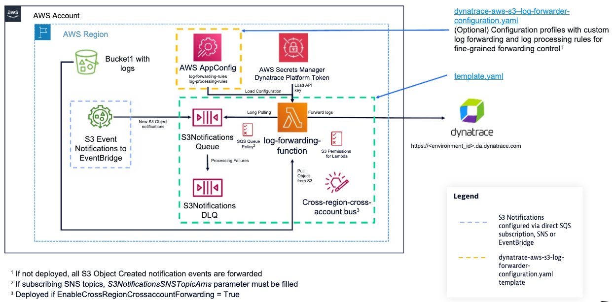

# Deployment instructions

## Prerequisites

The deployment instructions are written for Linux/MacOS. If you are running on Windows, use the Linux Subsystem for Windows, AWS CloudShell or an [AWS Cloud9](https://aws.amazon.com/cloud9/) instance.

You'll need the following software installed:

* [AWS CLI](https://docs.aws.amazon.com/cli/latest/userguide/getting-started-install.html)

You'll also need:

* A Dynatrace [platform token](https://docs.dynatrace.com/docs/manage/identity-access-management/access-tokens-and-oauth-clients/platform-tokens) for your tenant with the `data-acquisition:logs:ingest` scope (used to authenticate against the generic S3 logs ingest API).
* An AWS identity (user or role) with the required IAM permissions — see [Required AWS IAM permissions](iam_permissions.md).

## Deploy the dynatrace-aws-platform-monitoring-s3-log-forwarder

All core infrastructure — Lambda, SQS queues, IAM role, EventBridge rules, and S3 bucket permissions — is deployed from a single `template.yaml`. For a high level view of what's deployed, look at the diagram below:



### Step 1. Define a name for your `dynatrace-aws-platform-monitoring-s3-log-forwarder` deployment.

Define a name for your `dynatrace-aws-platform-monitoring-s3-log-forwarder` deployment (e.g. mycompany-dynatrace-s3-log-forwarder) and your Dynatrace tenant UUID (e.g. `abc12345` if your Dynatrace environment url is `https://abc12345.apps.dynatrace.com`) in environment variables that will be used along the deployment process.

```bash
export STACK_NAME=<replace-with-your-log-forwarder-stack-name>
export DYNATRACE_TENANT_UUID=<replace-with-your-dynatrace-tenant-uuid>
```

> [!IMPORTANT]
>
> Your stack name should have a maximum of 47 characters, otherwise deployment will fail.

### Step 2. Provide the Dynatrace platform token

The Lambda function needs a Dynatrace platform token (scope `data-acquisition:logs:ingest`) to authenticate against the log ingest API. There are three mutually exclusive options — choose one:

---

#### Option A: AWS Secrets Manager secret (recommended)

Store the token as a JSON secret in AWS Secrets Manager using the key `dt.platform_token`:

```bash
export HISTCONTROL=ignorespace
 export DT_TOKEN_SECRET_ARN=$(aws secretsmanager create-secret \
     --name "<your-secret-name>" \
     --secret-string '{"dt.platform_token":"<your_dynatrace_platform_token_here>"}' \
     --query 'ARN' --output text)
```

If you already have an existing Secrets Manager secret storing the token, use its ARN instead:

```bash
export DT_TOKEN_SECRET_ARN=<arn-of-your-existing-secrets-manager-secret>
```

---

#### Option B: AWS Systems Manager Parameter Store

Store the token as a SecureString parameter:

```bash
export HISTCONTROL=ignorespace
 aws ssm put-parameter \
     --name "/dynatrace/s3-log-forwarder/$STACK_NAME/api-key" \
     --type SecureString \
     --value "<your_dynatrace_platform_token_here>"
```

Pass `DynatraceApiKeySSMParameter="/dynatrace/s3-log-forwarder/$STACK_NAME/api-key"` in the deploy command in Step 4.

---

### Step 3. Download the CloudFormation templates

Download the CloudFormation templates for the latest release:

```bash
export VERSION_TAG=$(curl -s https://api.github.com/repos/dynatrace/dynatrace-aws-platform-monitoring-s3-log-forwarder/releases/latest | grep tag_name | cut -d'"' -f4)
mkdir dynatrace-aws-platform-monitoring-s3-log-forwarder && cd "$_"
wget https://dynatrace-aws-s3-log-forwarder-assets.s3.amazonaws.com/${VERSION_TAG}/templates.zip
unzip templates.zip
```

### Step 4. Deploy the Lambda function

#### Lambda Layer (recommended)

Dynatrace provides Lambda layers with each release of the `dynatrace-aws-platform-monitoring-s3-log-forwarder`, allowing for simple deployment and updates as new versions are released.

1. Deploy the main forwarder stack:

    ```bash
    aws cloudformation deploy \
        --stack-name ${STACK_NAME} \
        --template-file template.yaml \
        --capabilities CAPABILITY_IAM CAPABILITY_NAMED_IAM CAPABILITY_AUTO_EXPAND \
        --parameter-overrides \
            DynatraceEnvironmentURL="https://$DYNATRACE_TENANT_UUID.apps.dynatrace.com" \
            DynatraceApiKeySecretsManagerSecret="$DT_TOKEN_SECRET_ARN" \
            Architecture="x86_64" \
            GrantReadPermissionToBuckets="my-bucket,another-bucket"
    ```

    > [!NOTE]
    >
    > * Replace `DynatraceApiKeySecretsManagerSecret` with `DynatraceApiKeySSMParameter="/dynatrace/s3-log-forwarder/$STACK_NAME/api-key"` if you chose Option B in Step 2.
    > * When `GrantReadPermissionToBuckets` is set, the Lambda function IAM role is granted read access to all objects in those buckets. For fine-grained access controls, leave `GrantReadPermissionToBuckets` empty and follow the instructions in [Fine-grained access controls](#fine-grained-access-controls).
    > * See [CloudFormation parameter reference](cloudformation_parameters.md) for all available parameters.

---

> [!NOTE]
>
> * You can optionally configure notifications on your e-mail address to receive alerts when log files can't be processed and messages are arriving to the Dead Letter Queue. To do so, add the parameter `NotificationsEmail`=`your_email_address_here`.
> * An Amazon SNS topic named `<stack-name>-Alarms` is created to receive monitoring alerts where you can subscribe HTTP endpoints to send the notification to your tools. The topic ARN is available in the stack output as `SNSAlertsTopic`.
> * If you plan to configure S3 buckets via existing SNS topics (Option C in Step 5), add `S3NotificationsSNSTopicArns`=`<comma-separated-sns-topic-arns>` to `--parameter-overrides`.
> * See [CloudFormation parameter reference](cloudformation_parameters.md) for all available parameters and their default values.

### Step 5. Configure S3 buckets to send "S3 Object created" notifications to the log forwarder.

At this point, you have successfully deployed the `dynatrace-aws-platform-monitoring-s3-log-forwarder`. Now you need to configure each S3 bucket to send `Object Created` notifications to the log forwarder. There are three supported methods:

#### Option A: Amazon EventBridge

If you provided `GrantReadPermissionToBuckets` in Step 4, the main stack has already created an EventBridge rule routing `Object Created` events from the listed buckets to the SQS queue. You must also [enable EventBridge notifications](https://docs.aws.amazon.com/AmazonS3/latest/userguide/enable-event-notifications-eventbridge.html) on each bucket.

#### Option B: Direct S3 to SQS

Configure the S3 bucket to send `Object Created` notifications directly to the log forwarder's SQS queue. Retrieve the queue ARN first:

```bash
QUEUE_ARN=$(aws ssm get-parameter \
    --name "/dynatrace/s3-log-forwarder/${STACK_NAME}/sqs-queue-arn" \
    --query 'Parameter.Value' --output text)
```

Then configure the bucket notification ([AWS instructions](https://docs.aws.amazon.com/AmazonS3/latest/userguide/ways-to-add-notification-config-to-bucket.html)). The SQS queue policy already allows the buckets listed in `GrantReadPermissionToBuckets` to send notifications directly.

> [!NOTE]
> Direct S3 to SQS only works for buckets in the same AWS region as the log forwarder.

#### Option C: SNS fan-out

Use this option when you want multiple consumers to receive S3 `Object Created` notifications from the same bucket (fan-out), or when you already operate an SNS topic that aggregates S3 events. The flow is:

`S3 bucket → SNS topic → SQS queue → Lambda`

The log forwarder's SQS queue is subscribed to your SNS topic. You manage the SNS topic outside this stack.

##### Step 5c-1. Create an SNS topic

Create the SNS topic that your S3 bucket(s) will publish events to. Skip this step if you already have one.

```bash
export SNS_TOPIC_ARN=$(aws sns create-topic \
    --name ${STACK_NAME}-s3-notifications \
    --query TopicArn --output text)
```

> [!NOTE]
> To encrypt the topic with a customer-managed KMS key, add `--attributes KmsMasterKeyId=<key-id>` and follow the KMS prerequisite in step 5c-2 below before creating the topic.

##### Step 5c-2. Configure the SNS topic policy

Allow `s3.amazonaws.com` to publish `Object Created` notifications to the topic:

```bash
aws sns set-topic-attributes \
    --topic-arn $SNS_TOPIC_ARN \
    --attribute-name Policy \
    --attribute-value '{
      "Version": "2012-10-17",
      "Statement": [
        {
          "Sid": "AllowS3ToPublish",
          "Effect": "Allow",
          "Principal": { "Service": "s3.amazonaws.com" },
          "Action": "sns:Publish",
          "Resource": "'"$SNS_TOPIC_ARN"'",
          "Condition": {
            "StringEquals": { "aws:SourceAccount": "<your-aws-account-id>" },
            "ArnLike": { "aws:SourceArn": "arn:aws:s3:::<your-bucket-name>" }
          }
        }
      ]
    }'
```

> [!NOTE]
> **KMS key policy** (only if the topic is encrypted with a customer-managed key) — add the following statement to the key policy before creating the topic to allow `s3.amazonaws.com` to encrypt messages when publishing:
>
> ```json
> {
>   "Sid": "AllowS3ToUseKey",
>   "Effect": "Allow",
>   "Principal": { "Service": "s3.amazonaws.com" },
>   "Action": [
>     "kms:GenerateDataKey",
>     "kms:Decrypt"
>   ],
>   "Resource": "*",
>   "Condition": {
>     "StringEquals": { "aws:SourceAccount": "<your-aws-account-id>" },
>     "ArnLike": { "aws:SourceArn": "arn:aws:s3:::<your-bucket-name>" }
>   }
> }
> ```

##### Step 5c-3. Deploy the log forwarder stack with the SNS topic ARN(s)

Pass the topic ARN(s) via `S3NotificationsSNSTopicArns` in Step 4. This allows the listed topics to deliver messages to the SQS queue. If you have already deployed the stack, redeploy it adding the parameter:

```bash
aws cloudformation deploy \
    --stack-name ${STACK_NAME} \
    --template-file template.yaml \
    --capabilities CAPABILITY_IAM CAPABILITY_NAMED_IAM CAPABILITY_AUTO_EXPAND \
    --parameter-overrides \
        DynatraceEnvironmentURL="https://$DYNATRACE_TENANT_UUID.apps.dynatrace.com" \
        DynatraceApiKeySecretsManagerSecret="$DT_TOKEN_SECRET_ARN" \
        S3NotificationsSNSTopicArns="$SNS_TOPIC_ARN"
```

To pass multiple topic ARNs, provide them as a comma-separated list:

```bash
S3NotificationsSNSTopicArns="arn:aws:sns:us-east-1:123456789012:topic-a,arn:aws:sns:us-east-1:123456789012:topic-b"
```

##### Step 5c-4. Subscribe the SNS topic to the SQS queue

The stack only updates the SQS queue policy — you must create the subscription yourself. Retrieve the queue ARN and subscribe each topic to it:

```bash
QUEUE_ARN=$(aws ssm get-parameter \
    --name "/dynatrace/s3-log-forwarder/${STACK_NAME}/sqs-queue-arn" \
    --query 'Parameter.Value' --output text)

aws sns subscribe \
    --topic-arn $SNS_TOPIC_ARN \
    --protocol sqs \
    --notification-endpoint $QUEUE_ARN
```

##### Step 5c-5. Configure S3 bucket notifications to publish to the SNS topic

For each S3 bucket you want to forward logs from, enable `Object Created` notifications to the SNS topic:

```bash
export BUCKET_NAME=<your-bucket-name>

aws s3api put-bucket-notification-configuration \
    --bucket $BUCKET_NAME \
    --notification-configuration '{
      "TopicConfigurations": [
        {
          "TopicArn": "'"$SNS_TOPIC_ARN"'",
          "Events": ["s3:ObjectCreated:*"]
        }
      ]
    }'
```

> [!NOTE]
> S3 bucket notifications via SNS support native prefix and suffix filters. To forward only specific key prefixes, add a `Filter` block to the `TopicConfiguration`. See [Configuring S3 buckets with prefix filtering](advanced_deployments.md#configuring-s3-buckets-with-prefix-filtering) and the [AWS documentation](https://docs.aws.amazon.com/AmazonS3/latest/userguide/enable-event-notifications.html) for details.

## Advanced deployments

For detailed instructions on each scenario, see [advanced_deployments.md](advanced_deployments.md).

### Fine-grained access controls

When `GrantReadPermissionToBuckets` is set, the stack creates an EventBridge rule routing all `Object Created` events from those buckets to the SQS queue, and grants the Lambda function IAM role read access to all objects in those buckets — both with no prefix filtering. To restrict access to specific key prefixes, leave `GrantReadPermissionToBuckets` empty and follow the steps for your chosen notification option.

See [Configuring S3 buckets with prefix filtering](advanced_deployments.md#configuring-s3-buckets-with-prefix-filtering).

### Custom log forwarding and processing rules

Supported AWS-vended log types (see [src/log/processing/rules/aws/](../src/log/processing/rules/aws/)) are parsed automatically with no additional configuration. For any other log source, the default catch-all rule forwards S3 objects as generic plain text, but without structured attribute extraction.

To parse JSON logs, extract attributes via grok or JMESPath, add per-bucket annotations, or route different key prefixes within the same bucket to different sources or processing rules — deploy the optional `dynatrace-aws-s3-log-forwarder-appconfig.yaml` template and define custom forwarding and processing rules. Log parsing beyond what the forwarder supports must be performed using [Dynatrace OpenPipeline](https://docs.dynatrace.com/docs/analyze-explore-automate/logs/lma-log-processing/lma-openpipeline).

See [Custom log forwarding and processing rules via AppConfig](advanced_deployments.md#custom-log-forwarding-and-processing-rules-via-appconfig).

### IAM role path

If your organization policies require IAM roles to be created under a specific path (e.g. `/engineering/platform/`), use the `IamRolePath` parameter.

See [IAM Role path](advanced_deployments.md#iam-role-path).

### Cross-region forwarding

Centralize log forwarding from S3 buckets in different AWS regions into a single forwarder deployment. Requires enabling a dedicated EventBridge event bus on the main stack and deploying the `eventbridge-cross-region-or-account-forward-rules.yaml` template in the bucket's region.

See [Forward logs from S3 buckets on different AWS regions](advanced_deployments.md#forward-logs-from-s3-buckets-on-different-aws-regions).

### Cross-account forwarding

Forward logs from S3 buckets in different AWS accounts into a single forwarder deployment. Requires enabling the cross-account event bus, granting permissions to source accounts, and configuring bucket policies to allow the forwarder's IAM role.

See [Forward logs from S3 buckets on different AWS accounts](advanced_deployments.md#forward-logs-from-s3-buckets-on-different-aws-accounts).

## Next steps

At this stage, you should see logs being ingested in Dynatrace as they're written to Amazon S3.

You can explore logs using the Dynatrace [Logs and events viewer](https://docs.dynatrace.com/docs/observe-and-explore/logs/log-management-and-analytics/lma-analysis/logs-and-events), as well as create metrics and alerts based on ingested logs (see [Log metrics](https://docs.dynatrace.com/docs/observe-and-explore/logs/log-management-and-analytics/lma-analysis/lma-log-metrics) and [Log events](https://docs.dynatrace.com/docs/observe-and-explore/logs/log-management-and-analytics/lma-analysis/lma-log-events) documentation).

You can also perform deep log analysis with [Dynatrace Notebooks](https://docs.dynatrace.com/docs/observe-and-explore/notebook). See some example Dynatrace Query Language (DQL) queries below:

### Query logs ingested from S3 Bucket "mybucket"

```custom
fetch logs
| filter log.source.aws.s3.bucket.name == "mybucket"
```

### Query AWS CloudTrail logs:

```custom
fetch logs
| filter aws.service == "cloudtrail"
```

### Get the number of log entries per AWS Service

```custom
fetch logs
| filter isNotNull(aws.service) 
| summarize {count(),alias:log_entries}, by: aws.service
```

### Extract attributes from JSON Logs: Add sourceInstanceId log attribute from VPC DNS Query Logs

```custom
fetch logs 
| filter matchesValue(aws.service, "route53")
| parse content, "JSON:record"
| fieldsAdd record[srcids][instance], alias:sourceInstanceId
```

### Flatten a JSON formatted log

```custom
fetch logs 
| filter matchesValue(aws.service, "route53")
| parse content, "JSON:record"
| fieldsFlatten record
```

To learn more, check our [DQL documentation](https://docs.dynatrace.com/docs/platform/grail/dynatrace-query-language/dql-guide). You can also find a set of provided patterns to extract attributes for common logs in the [DPL Architect](https://docs.dynatrace.com/docs/platform/grail/dynatrace-pattern-language/dpl-architect).

For more detailed information and advanced configuration details of the `dynatrace-aws-platform-monitoring-s3-log-forwarder`, visit the documentation in the `docs` folder.
