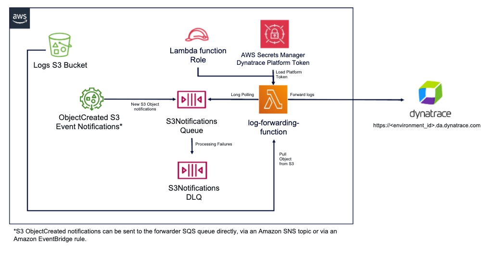

# dynatrace-aws-s3-log-forwarder

This project deploys a Serverless architecture to forward logs from Amazon S3 to Dynatrace.

## Support

This project is officially supported by Dynatrace. Before you create a ticket check the documentation in the `docs` folder. If you didn't find a solution please [contact Dynatrace support](https://www.dynatrace.com/support/contact-support/).

## Supported AWS Services

The `dynatrace-aws-s3-log-forwarder` supports out-of-the-box parsing and forwarding of logs for the following AWS Services:

* AWS Elastic Load Balancing access logs (ALB, NLB and Classic ELB)
* Amazon CloudFront access logs
* AWS CloudTrail logs
* AWS Global Accelerator Flow logs
* Amazon Managed Streaming for Kafka logs
* AWS Network Firewall alert and flow logs
* Amazon Redshift audit logs
* Amazon S3 access logs
* Amazon VPC DNS query logs
* Amazon VPC Flow logs (default logs)
* AWS WAF logs
* AWS AppFabric OCSF-JSON logs (Raw-JSON logs require a custom processing rule)

Additionally, you can ingest any generic text and JSON logs. For more information, visit [Log Forwarding](log_forwarding.md).

> **Important:** Log events with timestamps older than 24 hours are dropped by Dynatrace.

## Getting Started

* To deploy, follow the [Deployment Guide](deployment_guide.md).
* To update an existing deployment, follow the [Update Guide](update_guide.md).
